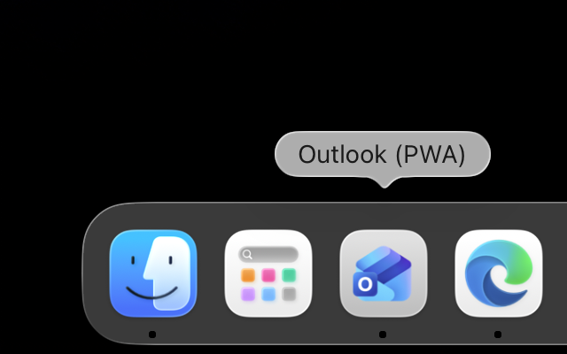
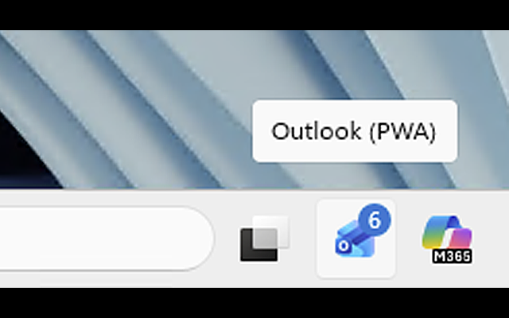
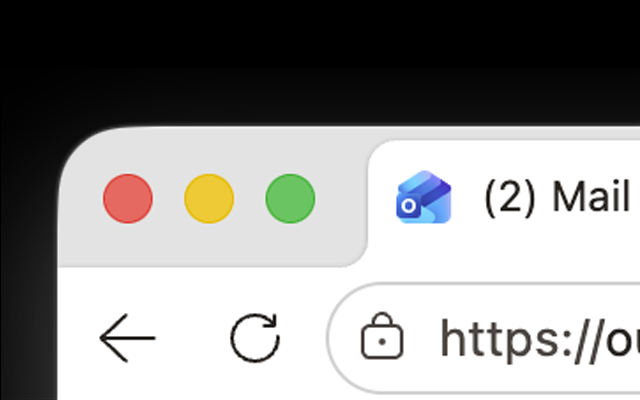
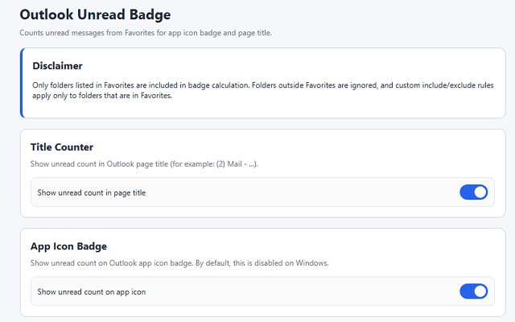
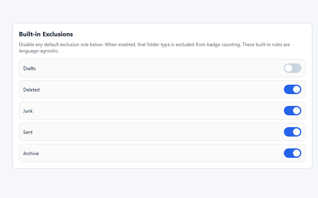
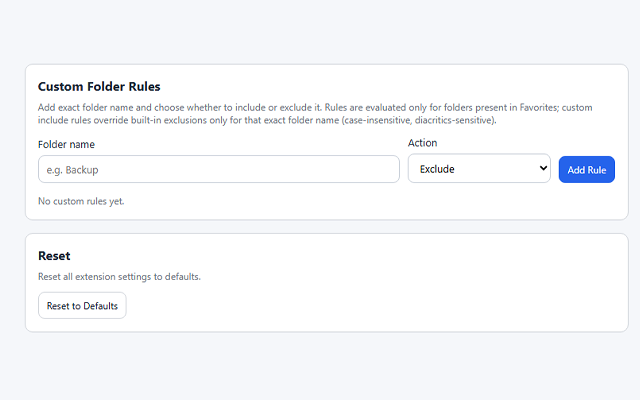

# Outlook Unread Badge (Chromium Extension)

This extension reads unread email count from Outlook Web (`outlook.office.com` / `outlook.live.com` / `outlook.cloud.microsoft`) and updates the installed Outlook app icon badge using the Badging API. Work accounts routed through Microsoft Defender for Cloud Apps (`outlook.cloud.microsoft.mcas.ms`) are supported via an opt-in setting.

## How it works

- `content.js` sums unread counts from folders listed under `Favorites`.
- Optional title counter (enabled by default): prepends unread count to the page title (for example `(2) Mail – ...`).
- Optional app icon badge counter: can be disabled in settings, and defaults to disabled on Windows when unset.
- It excludes common system folders by default using folder icon signatures (language-agnostic): `Drafts`, `Deleted`, `Junk`, `Sent`, `Archive`.
- In settings, you can disable any built-in exclusion with toggle switches.
- You can override folder handling with custom rules in extension settings (`Include` / `Exclude` by folder name; last matching rule wins), but these rules are applied only to folders currently present in `Favorites`.
- It posts unread count events into page context.
- `injected-bridge.js` runs in page context and calls:
  - `navigator.setAppBadge(count)`
  - `navigator.clearAppBadge()`

## Work accounts behind Defender for Cloud Apps (MCAS)

Some organizations route Outlook Web through a Microsoft Defender for Cloud Apps session proxy. You can recognize this by the address ending with `.mcas.ms` (for example `outlook.cloud.microsoft.mcas.ms`). On these domains the extension does not run by default.

To enable it:

- Open extension settings and turn on the toggle in the **Defender for Cloud Apps (MCAS) Support** section, or
- open the extension popup while on an MCAS-proxied Outlook tab — it detects the proxy and offers a one-click **Enable proxy support** button.

Either way, the browser asks for permission for `outlook.cloud.microsoft.mcas.ms` only (no wildcard access). The settings page also opens automatically once after installation, with a hint pointing to this option. Regional MCAS variants (for example `*.us2.mcas.ms`) are not covered yet — open an issue if you need one.

## Install locally (Edge/Chrome)

1. Open `edge://extensions` (or `chrome://extensions`).
2. Enable **Developer mode**.
3. Click **Load unpacked**.
4. Select this folder.
5. Open Outlook PWA (`outlook.office.com`) in your installed app window.
6. Open extension settings and define custom folder rules if needed:
   - `edge://extensions` -> Outlook Unread Badge -> **Extension options**
   - or `chrome://extensions` -> Outlook Unread Badge -> **Extension options**

## Notes

- This sets the **PWA app icon badge** (Dock/taskbar), not the extension toolbar badge.
- Badge behavior depends on browser + OS support for Badging API.
- Outlook UI changes may require selector/title parsing updates.
- If `Favorites` is unavailable, the extension falls back to unread count from window title if present.
- Settings disclaimer: only folders in `Favorites` are considered for counting.
- On MCAS-proxied domains, the proxy rewrites `event.origin` of window messages to the original (un-proxied) host; `injected-bridge.js` accounts for this when validating messages.

## Screenshots

